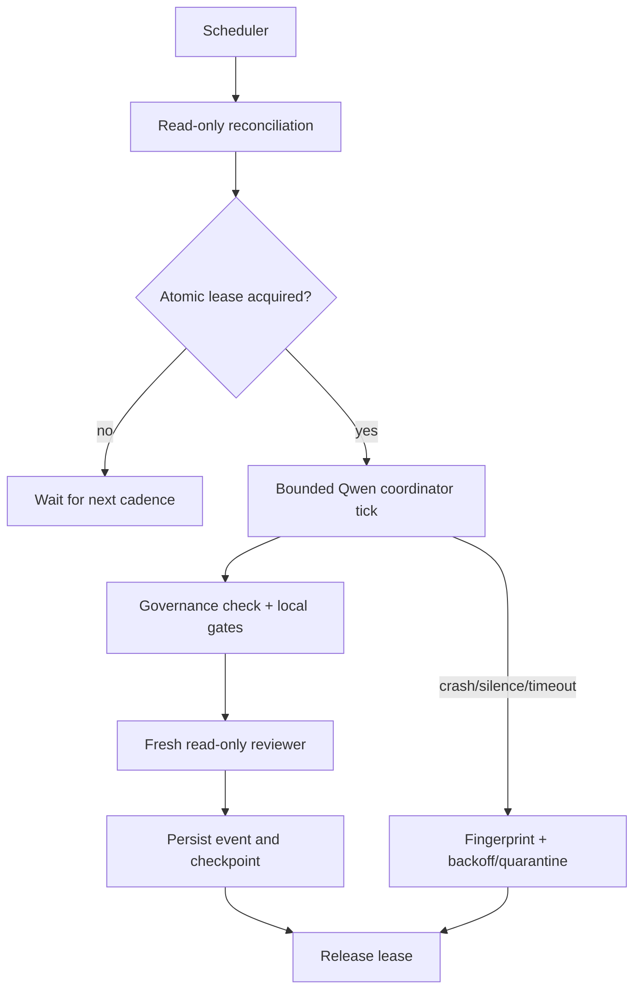

# Qwen Autonomous Supervisor

[](LICENSE)


A durable host supervisor that keeps **Qwen Code** operating in bounded,
recoverable autonomy ticks without treating an LLM conversation as the source
of truth.

The supervisor does not reimplement a coding agent. Qwen Code still reads,
edits, tests and uses Git/GitHub. This project owns the operational reliability
layer around it: scheduling, exclusivity, watchdogs, durable evidence, recovery,
quality gates, independent review, quarantine and health reporting.

## Why this matters across industries

Making an autonomous LLM-driven process safe to leave running unattended — durable state instead of trusting the conversation, exclusivity locks, watchdogs, and independent quality gates before anything ships — is the exact operational-reliability problem every organization deploying agentic AI now faces, regardless of what the agent itself does. That makes this directly relevant to tech/AI (agent infrastructure generally), to consulting (clients adopting AI agents need exactly this kind of safety harness, not just a demo), and to any regulated or safety-conscious environment (finance, industrial operations) where an autonomous process's failure mode has to be bounded and recoverable, not "hope the model behaves."

## Safety model

- One coordinator process can mutate the target at a time. SQLite acquisition
  is atomic and its lease is renewed throughout the run.
- A second OS-level scheduler lock prevents two persistent loops sharing one
  runtime directory.
- Every tick has wall-time, tool-call, turn and output-silence budgets.
- Per-call output tokens and global token/cost ceilings are enforced per tick,
  rolling hour, rolling day and Issue. Every call is charged even when it fails.
- A lost lease, silent child or wall-time overrun stops the complete child
  process tree.
- The target worktree must be clean before and after a mutating tick.
- Changes to `AUTONOMY.md`, `.autonomy/**`, `.github/workflows/**` and
  `.github/CODEOWNERS` are blocked outside the model, even if the model asks.
- Product mutations must pass configured commands and a separate read-only
  Qwen session in fresh context. A mutation cannot opt out of that review.
- Three identical failures are quarantined. Provider 429/5xx and temporary
  network outages enter bounded `waiting` backoff without failure-loop retries.
- Work quarantine is Issue-scoped and does not stop unrelated work; host
  quarantine stops new model launches until a maintainer clears it.
- The remote-operation API provides reconcile-before-mutate records and stable
  markers, so GitHub adapters can recover a crash after remote success but
  before SQLite persistence without duplicating an Issue, PR, comment, push or
  merge. The coordinator contract requires this API pattern for every mutation.
- Runtime state lives outside the target repository. Credentials and the
  environment are never written into event payloads.
- The Qwen child receives only variables matching `qwen.environmentAllowlist`,
  so unrelated service secrets are not inherited by default.
- SQLite is integrity-checked at startup and recovery. Disk-free thresholds,
  rotating JSONL logs and age/count artifact retention run before model launch.



## Requirements

- Python 3.11+
- Git
- [Qwen Code](https://github.com/QwenLM/qwen-code), authenticated for the
  chosen model
- GitHub CLI (`gh`) authenticated for issue/PR workflows
- A target repository whose branch protection and bot permissions enforce its
  governance contract

Qwen Code and `gh` are deliberately external. `qas doctor` reports their
absence without silently installing or authenticating them.

## Install

```bash
python -m venv .venv
. .venv/bin/activate
python -m pip install -e .
cp config/supervisor.example.yml supervisor.yml
```

On PowerShell, activate with `.venv\Scripts\Activate.ps1`. Edit
`supervisor.yml`; `projectRoot` identifies the product repository and
`runtimeDir` **must be outside it**.

Validate before any model is launched:

```bash
qas --config supervisor.yml validate
qas --config supervisor.yml doctor
qas --config supervisor.yml audit-governance
```

For an OpenAI-compatible LiteLLM endpoint, copy `.env.example` to `.env`, keep
the key local, and load it explicitly:

```powershell
qas --env-file .env --config supervisor.yml doctor
qas --env-file .env --config supervisor.yml tick
```

The included example selects `claude-sonnet-5`, disables in-process unattended
retry, caps model output, and enables the host certificate store for enterprise
TLS interception without setting `NODE_TLS_REJECT_UNAUTHORIZED=0`.

The included target contract templates under `templates/target/` are a safe
starting point, not an automatic migration. Copy and adapt them manually,
replace every `replace-me`, configure GitHub branch protection/CODEOWNERS, then
commit them through a human-reviewed governance change.

## Run

One bounded tick:

```bash
qas --config supervisor.yml tick
```

Persistent cadence:

```bash
qas --config supervisor.yml loop
```

Recovery and inspection never invoke the model:

```bash
qas --config supervisor.yml recover
qas --config supervisor.yml status
qas --config supervisor.yml events --limit 100
qas --config supervisor.yml failures
```

Run a deterministic dogfood scenario:

```bash
qas --config supervisor.yml dogfood examples/dogfood/smoke.yml
```

Run a bounded endurance campaign, optionally with deliberate Qwen process
crashes:

```bash
qas --config supervisor.yml campaign --duration 4h --minimum-successful-ticks 3
qas --config supervisor.yml campaign --duration 12h --chaos-every 45m
```

See [docs/VALIDATION_CAMPAIGN.md](docs/VALIDATION_CAMPAIGN.md) for the disposable
GitHub fixture, reboot drill and the 15-minute → 16-day validation ladder.

Expose local health and metrics:

```bash
qas --config supervisor.yml serve
curl http://127.0.0.1:8787/healthz
curl http://127.0.0.1:8787/status
curl http://127.0.0.1:8787/metrics
```

Status includes uptime, active PID/heartbeat, state, Issue, lease, Git
branch/HEAD cleanliness, current PR/CI rollup, last success/failure, tick delivery
counts, quarantines, model calls, token/cost budget consumption, estimated cost
and disk headroom. Cost budgets require provider prices under `observability`.

Binding observability to a non-loopback address is refused unless
`QAS_OBSERVABILITY_TOKEN` is set. In that case callers must send
`Authorization: Bearer <token>`.

## Qwen invocation

Each coordinator run uses Qwen Code's documented headless primitives:

- `--output-format stream-json` for live activity and session capture;
- `--json-schema @...` for a machine-verifiable terminal result;
- `--max-wall-time`, `--max-tool-calls`, and `--max-session-turns`;
- `--sandbox` by default and an explicit approval mode;
- `QWEN_CODE_MAX_OUTPUT_TOKENS` derived from the supervisor configuration.

The outer scheduler owns provider backoff. `persistentRetry` defaults to false,
so a 429/5xx cannot create a hidden retry/spend loop inside one Qwen process.

The independent reviewer starts a new session in Qwen safe mode and disables
project customizations. Its tool budget is fixed at one for Qwen's mandatory,
read-only `get_goal`; any second ordinary tool is stopped before execution,
while the terminal `structured_output` call is exempt. It receives the
coordinator result and complete Git diff as untrusted data and cannot reuse the
implementation context. The mutating coordinator still requires the configured
external sandbox.

## Durable state

`runtime/state.db` uses SQLite WAL mode. The important records are:

- `events`: append-only transitions and evidence; update/delete are rejected by
  database triggers and operation keys make mutations idempotent;
- `runs`: process lifecycle, PID, session ID, heartbeat and output path;
- `leases`: atomic ownership and expiration;
- `failures`: normalized fingerprints, counts and quarantine state;
- `checkpoints`: last reconciliation and scheduler backoff.

Raw child output is written as JSONL under `runtime/runs/`. It is operational
data and must not be committed. Files rotate at `storage.maxLogBytes`; old run
and campaign artifacts are removed by the configured age/count retention.

The persistent scheduler does not retry while a quarantined host failure
exists. After a maintainer supplies new evidence or fixes the cause, retry must
be re-enabled explicitly and audibly:

```bash
qas --config supervisor.yml unquarantine <fingerprint> --reason "Qwen upgraded and verified"
```

## Crash behavior

On startup the loop reaps expired leases. A run whose heartbeat exceeds the
silence threshold is abandoned even if its PID is still alive; that recorded
process tree is classified as hung and terminated before recovery continues.
The next coordinator reconstructs its position from Git, GitHub and the ledger
snapshot; restarting never means blindly repeating a mutation.

## Deployment

`Dockerfile` installs Qwen Code and runs as an unprivileged user under `tini`.
`compose.yml` mounts the target, config and a separate persistent runtime
volume. Set `TARGET_REPOSITORY` before starting it. Provider credentials should
be injected through the environment or a secret manager, never committed.

For Linux hosts, `deploy/qas.service` is a hardened systemd baseline. Adjust
`ReadWritePaths`, the service account and paths for the host. The scheduler is
also safe to run directly under another process manager because its lock is
exclusive and crash-released.

On native Windows, use `deploy/windows/install-task.ps1` to install a
restart-on-boot Task Scheduler job. Docker/WSL2 or a Linux VM remains preferable
for multi-day production campaigns. `systemd` applies only to Linux.

## What remains external by design

The supervisor cannot create the trust boundary by itself. Production rollout
still requires:

1. a dedicated bot identity with least-privilege repository permissions;
2. protected default branch, required checks, CODEOWNERS and no bypass grant;
3. model/provider credentials from a host secret store;
4. product-specific commands and dogfood scenarios;
5. backups for the runtime directory and external alert routing.

This separation is intentional: the development bot must not be able to edit
the controls that authorize its own work.

## Development

```bash
python -m pip install -e ".[dev]"
ruff check .
mypy
pytest --cov=qas --cov-report=term-missing
```

No Qwen, GitHub, Docker or network access is required by the test suite. Process
watchdog tests use a deterministic local child process. The `live_e2e` test is
skipped unless `QAS_LIVE_E2E_CONFIG` points at an authenticated disposable
repository; local green tests alone are not claimed as long-horizon proof.
